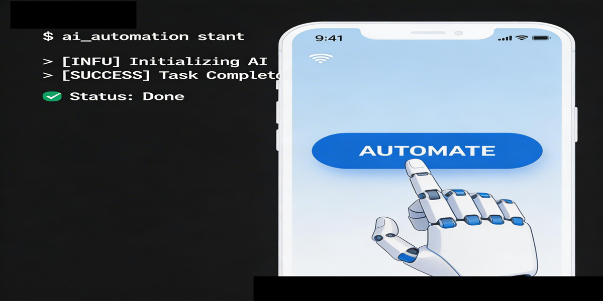
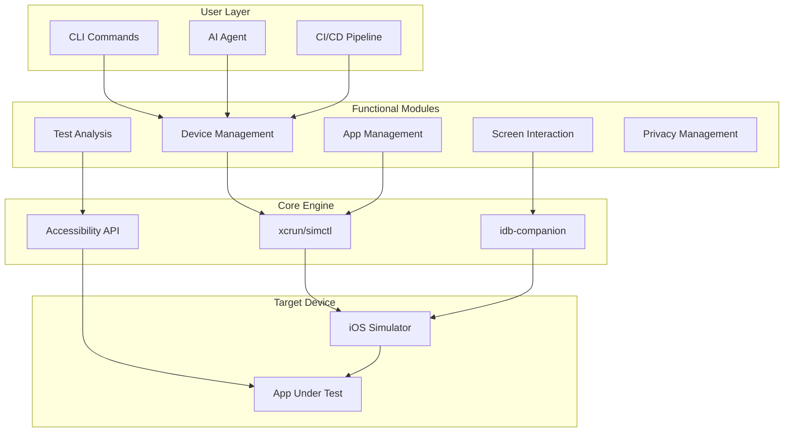

<!-- PROJECT BADGES -->
<div align="center">

# 🚀 OpenCode iOS Simulator

<i>iOS Simulator Automation CLI Tool for the AI Era</i>

[](https://pypi.org/project/opencode-ios-simulator/)
[](https://pypi.org/project/opencode-ios-simulator/)
[](#)
[](LICENSE)
[](https://github.com/BOMBFUOCK/opencode-ios-simulator/stargazers)

---

[English](README.md) | [中文](README_zh.md)

</div>

---

## ✨ Why Choose Us?

<p align="center">
  
</p>

| Traditional Way | Using Our Tool |
|-----------------|----------------|
| ❌ Manual button clicking | ✅ One command does it all |
| ❌ Repetitive waste of time | ✅ Automated batch processing |
| ❌ Complex API learning curve | ✅ Simple CLI, ready to use |
| ❌ Hard to integrate with CI/CD | ✅ Perfect automation support |

---

## 🎯 Key Features

```
┌─────────────────────────────────────────────────────────────────┐
│                                                                 │
│   📱 Device Management    🧪 Test Analysis    🔧 Build Tools  │
│   ┌───────────┐          ┌───────────┐        ┌───────────┐   │
│   │ sim list  │          │ sim audit │        │ sim build │   │
│   │ sim boot  │          │ sim diff  │        │ sim test  │   │
│   │ sim create│          │ sim log   │        │           │   │
│   └───────────┘          └───────────┘        └───────────┘   │
│                                                                 │
│   🎨 Screen Interaction  🔐 Privacy Manager  📊 State Capture │
│   ┌───────────┐          ┌───────────┐        ┌───────────┐   │
│   │ sim tap   │          │sim privacy│        │ sim state │   │
│   │ sim swipe │          │sim push   │        │ sim tree  │   │
│   │ sim text  │          │sim clipboard       │ sim map   │   │
│   └───────────┘          └───────────┘        └───────────┘   │
│                                                                 │
└─────────────────────────────────────────────────────────────────┘
```

### 🔥 Unique Advantages

- 🤖 **AI-Native Design** - Built specifically for AI Agent automation
- ⚡ **Quick Setup** - Install and configure in 5 minutes
- 🔄 **Full Automation** - Complete iOS simulator lifecycle coverage
- 🎪 **Accessibility-First** - Stable and reliable based on Accessibility API
- 📦 **Ready to Use** - No complex config, production-ready out of the box

---

## 🏗️ Architecture



---

## 📦 Installation

```bash
# 1️⃣ Install idb-companion (required)
brew install idb-companion

# 2️⃣ Install opencode-ios-simulator
pip install --upgrade opencode-ios-simulator

# 3️⃣ Verify installation
sim check
```

---

## 🚀 Quick Start

```bash
# Check environment ✅
sim check

# Boot simulator 📱
sim boot "iPhone 17 Pro"

# Install app 📦
sim install app.ipa

# Launch app ▶️
sim launch com.example.myapp

# Map screen elements 🗺️
sim map

# Tap button 👆
sim tap --text "Confirm"

# Input text ✍️
sim text "hello world"

# Swipe 👋
sim swipe up

# Shutdown simulator ⏹️
sim shutdown
```

---

## 📸 Demo

### Screen Mapping
```
┌─────────────────────────────────────┐
│ 📱 iPhone 17 Pro - Home Screen      │
├─────────────────────────────────────┤
│ ┌─────────────────────────────────┐ │
│ │ ⚙️ Settings               [≣] │ │
│ ├─────────────────────────────────┤ │
│ │ 🔍 Search Settings...          │ │
│ ├─────────────────────────────────┤ │
│ │ 👤 Apple ID                    │ │
│ │ 📶 Wi-Fi                       │ │
│ │ 🔔 Notifications              │ │
│ │ 🔊 Sounds & Haptics           │ │
│ │ 🌙 Display & Brightness       │ │
│ └─────────────────────────────────┘ │
└─────────────────────────────────────┘
```

### Environment Check
```
✓ macOS 26.2        - OK
✓ Xcode 18.3        - Installed
✓ simctl            - Available
✓ idb-companion     - Connected
✓ Python 3.12       - Ready

🎉 Environment ready!
```

---

## 📋 Command Reference

| Category | Command | Description |
|----------|---------|-------------|
| 🔰 Basics | `sim check` | Check environment |
| 📱 Device | `sim list` | List simulators |
| 📱 Device | `sim boot` | Boot simulator |
| 📱 Device | `sim shutdown` | Shutdown simulator |
| 📦 App | `sim install` | Install app |
| 📦 App | `sim launch` | Launch app |
| 👆 Interaction | `sim tap` | Tap element |
| 👆 Interaction | `sim swipe` | Swipe screen |
| 👆 Interaction | `sim text` | Input text |
| 🧪 Testing | `sim audit` | Accessibility audit |
| 🧪 Testing | `sim diff` | Visual diff |
| 🔐 Privacy | `sim privacy` | Privacy settings |

---

## 📋 Full Command List

### Device Lifecycle (6)
| Command | Description | Example |
|---------|-------------|---------|
| `sim list` | List simulators | `sim list --state booted` |
| `sim boot` | Boot simulator | `sim boot "iPhone 17 Pro"` |
| `sim shutdown` | Shutdown simulator | `sim shutdown` |
| `sim create` | Create simulator | `sim create "iPhone 17 Pro" --ios 26.3` |
| `sim delete` | Delete simulator | `sim delete --udid XXX --force` |
| `sim erase` | Erase simulator | `sim erase` |

### App Management (4)
| Command | Description | Example |
|---------|-------------|---------|
| `sim launch` | Launch app | `sim launch com.apple.Preferences` |
| `sim terminate` | Terminate app | `sim terminate com.apple.Preferences` |
| `sim install` | Install app | `sim install app.ipa` |
| `sim uninstall` | Uninstall app | `sim uninstall com.app` |

### Navigation & Interaction (5)
| Command | Description | Example |
|---------|-------------|---------|
| `sim map` | Map screen elements | `sim map` |
| `sim tree` | Accessibility tree | `sim tree` |
| `sim tap` | Tap element | `sim tap --text "General"` |
| `sim text` | Input text | `sim text "hello"` |
| `sim swipe` | Swipe | `sim swipe up` |

### Advanced Interaction (2)
| Command | Description | Example |
|---------|-------------|---------|
| `sim key` | Press key | `sim key return` |
| `sim button` | Hardware button | `sim button home` |

### Testing & Analysis (4)
| Command | Description | Example |
|---------|-------------|---------|
| `sim audit` | Accessibility audit | `sim audit` |
| `sim diff` | Visual diff | `sim diff base.png curr.png` |
| `sim log` | Log monitoring | `sim log --app com.app` |
| `sim state` | State capture | `sim state` |

### Privacy & Settings (4)
| Command | Description | Example |
|---------|-------------|---------|
| `sim privacy` | Privacy settings | `sim privacy --grant camera --bundle-id com.app` |
| `sim push` | Push notification | `sim push --title "Hi" --body "Hello"` |
| `sim clipboard` | Clipboard | `sim clipboard "text"` |
| `sim statusbar` | Status bar | `sim statusbar --get` |

### Build (2)
| Command | Description | Example |
|---------|-------------|---------|
| `sim build` | Build project | `sim build --project App.xcodeproj` |
| `sim test` | Run tests | `sim test --project App.xcodeproj` |

### Info (2)
| Command | Description | Example |
|---------|-------------|---------|
| `sim check` | Environment check | `sim check` |
| `sim booted` | Booted devices | `sim booted` |

---

## 🔧 JSON Output

All commands support `--json`:

```bash
sim list --json
# {"simulators": [...], "count": 11}

sim check --json
# {"ready": true, "checks": {...}}
```

---

## 📦 Dependencies

- macOS + Xcode
- idb-companion (`brew install idb-companion`)
- Python 3.10+
- Pillow (for visual diff)

---

## 🤝 Contributors

<!-- CONTRIBUTORS -->
<p align="center">
  <a href="https://github.com/BOMBFUOCK">
    
  </a>
</p>

<p align="center">
  <strong>BOMBFUOCK</strong> - Founder & Main Maintainer
</p>

---

## 📄 License

MIT License - See [LICENSE](LICENSE) for details

---

## 🙏 Acknowledgements

- [Apple](https://apple.com) - Xcode & Simulator
- [OpenCode](https://opencode.ai) - AI Coding Assistant
- [idb-companion](https://github.com/facebook/idb) - iOS Automation Infrastructure

---

<div align="center">

**⭐ If this project helps you, please give us a Star!**

[](https://github.com/BOMBFUOCK/opencode-ios-simulator)

Made with ❤️ by [BOMBFUOCK](https://github.com/BOMBFUOCK)

</div>
