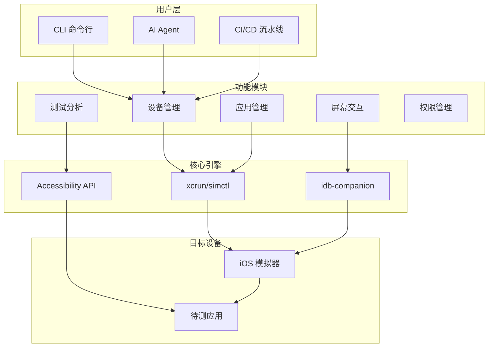

<!-- 项目徽章 -->
<div align="center">

# 🚀 OpenCode iOS Simulator

<i>AI 时代的 iOS 模拟器自动化命令行工具</i>

[](https://pypi.org/project/opencode-ios-simulator/)
[](https://pypi.org/project/opencode-ios-simulator/)
[](#)
[](LICENSE)
[](https://github.com/BOMBFUOCK/opencode-ios-simulator/stargazers)

---

[English](README.md) | [中文](README_zh.md)

</div>

---

## ✨ 为什么选择我们？

<p align="center">
  
</p>

| 传统方式 | 使用我们的工具 |
|----------|---------------|
| ❌ 手动点击每个按钮 | ✅ 一行命令完成操作 |
| ❌ 重复性工作浪费生命 | ✅ 自动化批量处理 |
| ❌ 需要学习复杂 API | ✅ 简单 CLI，上手即用 |
| ❌ 难以集成到 CI/CD | ✅ 完美支持自动化流程 |

---

## 🎯 核心特性

```
┌─────────────────────────────────────────────────────────────────┐
│                                                                 │
│   📱 设备管理           🧪 测试分析           🔧 构建工具      │
│   ┌───────────┐        ┌───────────┐        ┌───────────┐     │
│   │ sim list  │        │ sim audit │        │ sim build │     │
│   │ sim boot  │        │ sim diff  │        │ sim test  │     │
│   │ sim create│        │ sim log   │        │           │     │
│   └───────────┘        └───────────┘        └───────────┘     │
│                                                                 │
│   🎨 屏幕交互           🔐 权限管理           📊 状态捕获        │
│   ┌───────────┐        ┌───────────┐        ┌───────────┐     │
│   │ sim tap   │        │sim privacy│        │ sim state │     │
│   │ sim swipe │        │sim push   │        │ sim tree  │     │
│   │ sim text  │        │sim clipboard       │ sim map   │     │
│   └───────────┘        └───────────┘        └───────────┘     │
│                                                                 │
└─────────────────────────────────────────────────────────────────┘
```

### 🔥 独特优势

- 🤖 **AI 原生设计** - 专为 AI Agent 打造的自动化工具
- ⚡ **极速上手** - 5 分钟内完成安装配置
- 🔄 **全面自动化** - 覆盖 iOS 模拟器全生命周期
- 🎪 **无障碍优先** - 基于 Accessibility API，稳定可靠
- 📦 **开箱即用** - 无需复杂配置，立即投入生产

---

## 🏗️ 架构图



---

## 📦 安装

```bash
# 1️⃣ 安装 idb-companion (必需)
brew install idb-companion

# 2️⃣ 安装 opencode-ios-simulator
pip install --upgrade opencode-ios-simulator

# 3️⃣ 验证安装
sim check
```

---

## 🚀 快速开始

```bash
# 检查环境 ✅
sim check

# 启动模拟器 📱
sim boot "iPhone 17 Pro"

# 安装应用 📦
sim install app.ipa

# 启动应用 ▶️
sim launch com.example.myapp

# 映射屏幕元素 🗺️
sim map

# 点击按钮 👆
sim tap --text "确认"

# 输入文本 ✍️
sim text "hello world"

# 滑动操作 👋
sim swipe up

# 关闭模拟器 ⏹️
sim shutdown
```

---

## 📸 效果展示

### 屏幕映射
```
┌─────────────────────────────────────┐
│ 📱 iPhone 17 Pro - 主屏幕           │
├─────────────────────────────────────┤
│ ┌─────────────────────────────────┐ │
│ │ ⚙️ 设置                    [≣] │ │
│ ├─────────────────────────────────┤ │
│ │ 🔍 搜索设置...                  │ │
│ ├─────────────────────────────────┤ │
│ │ 👤 Apple ID                     │ │
│ │ 📶 Wi-Fi                        │ │
│ │ 🔔 通知                         │ │
│ │ 🔊 声音与触感                   │ │
│ │ 🌙 显示与亮度                   │ │
│ └─────────────────────────────────┘ │
└─────────────────────────────────────┘
```

### 环境检查
```
✓ macOS 26.2        - 正常
✓ Xcode 18.3        - 已安装
✓ simctl            - 可用
✓ idb-companion     - 已连接
✓ Python 3.12       - 就绪

🎉 环境配置完成！
```

---

## 📋 命令一览

| 分类 | 命令 | 说明 |
|------|------|------|
| 🔰 基础 | `sim check` | 检查环境配置 |
| 📱 设备 | `sim list` | 列出模拟器 |
| 📱 设备 | `sim boot` | 启动模拟器 |
| 📱 设备 | `sim shutdown` | 关闭模拟器 |
| 📦 应用 | `sim install` | 安装应用 |
| 📦 应用 | `sim launch` | 启动应用 |
| 👆 交互 | `sim tap` | 点击元素 |
| 👆 交互 | `sim swipe` | 滑动屏幕 |
| 👆 交互 | `sim text` | 输入文本 |
| 🧪 测试 | `sim audit` | 无障碍审计 |
| 🧪 测试 | `sim diff` | 视觉对比 |
| 🔐 权限 | `sim privacy` | 权限管理 |

---

## 📋 完整命令列表

### 设备生命周期 (6)
| 命令 | 说明 | 示例 |
|------|------|------|
| `sim list` | 列出模拟器 | `sim list --state booted` |
| `sim boot` | 启动模拟器 | `sim boot "iPhone 17 Pro"` |
| `sim shutdown` | 关闭模拟器 | `sim shutdown` |
| `sim create` | 创建模拟器 | `sim create "iPhone 17 Pro" --ios 26.3` |
| `sim delete` | 删除模拟器 | `sim delete --udid XXX --force` |
| `sim erase` | 重置模拟器 | `sim erase` |

### 应用管理 (4)
| 命令 | 说明 | 示例 |
|------|------|------|
| `sim launch` | 启动应用 | `sim launch com.apple.Preferences` |
| `sim terminate` | 终止应用 | `sim terminate com.apple.Preferences` |
| `sim install` | 安装应用 | `sim install app.ipa` |
| `sim uninstall` | 卸载应用 | `sim uninstall com.app` |

### 导航与交互 (5)
| 命令 | 说明 | 示例 |
|------|------|------|
| `sim map` | 映射屏幕元素 | `sim map` |
| `sim tree` | 无障碍树 | `sim tree` |
| `sim tap` | 点击元素 | `sim tap --text "通用"` |
| `sim text` | 输入文本 | `sim text "hello"` |
| `sim swipe` | 滑动 | `sim swipe up` |

### 高级交互 (2)
| 命令 | 说明 | 示例 |
|------|------|------|
| `sim key` | 按键 | `sim key return` |
| `sim button` | 硬件按钮 | `sim button home` |

### 测试与分析 (4)
| 命令 | 说明 | 示例 |
|------|------|------|
| `sim audit` | 无障碍审计 | `sim audit` |
| `sim diff` | 视觉对比 | `sim diff base.png curr.png` |
| `sim log` | 日志监控 | `sim log --app com.app` |
| `sim state` | 状态捕获 | `sim state` |

### 权限与设置 (4)
| 命令 | 说明 | 示例 |
|------|------|------|
| `sim privacy` | 权限管理 | `sim privacy --grant camera --bundle-id com.app` |
| `sim push` | 推送通知 | `sim push --title "Hi" --body "Hello"` |
| `sim clipboard` | 剪贴板 | `sim clipboard "text"` |
| `sim statusbar` | 状态栏 | `sim statusbar --get` |

### 构建 (2)
| 命令 | 说明 | 示例 |
|------|------|------|
| `sim build` | 构建项目 | `sim build --project App.xcodeproj` |
| `sim test` | 运行测试 | `sim test --project App.xcodeproj` |

### 信息 (2)
| 命令 | 说明 | 示例 |
|------|------|------|
| `sim check` | 环境检查 | `sim check` |
| `sim booted` | 已启动设备 | `sim booted` |

---

## 🔧 JSON 输出

所有命令支持 `--json`：

```bash
sim list --json
# {"simulators": [...], "count": 11}

sim check --json
# {"ready": true, "checks": {...}}
```

---

## 📦 依赖

- macOS + Xcode
- idb-companion (`brew install idb-companion`)
- Python 3.10+
- Pillow（用于视觉对比）

---

## 🤝 贡献者

<!-- CONTRIBUTORS -->
<p align="center">
  <a href="https://github.com/BOMBFUOCK">
    
  </a>
</p>

<p align="center">
  <strong>BOMBFUOCK</strong> - 创始人 & 主要维护者
</p>

---

## 📄 许可证

MIT License - 查看 [LICENSE](LICENSE) 了解详情

---

## 🙏 感谢

- [Apple](https://apple.com) - Xcode & Simulator
- [OpenCode](https://opencode.ai) - AI 编程助手
- [idb-companion](https://github.com/facebook/idb) - iOS 自动化基础设施

---

<div align="center">

**⭐ 如果这个项目对你有帮助，请给我们一个 Star！**

[](https://github.com/BOMBFUOCK/opencode-ios-simulator)

Made with ❤️ by [BOMBFUOCK](https://github.com/BOMBFUOCK)

</div>
